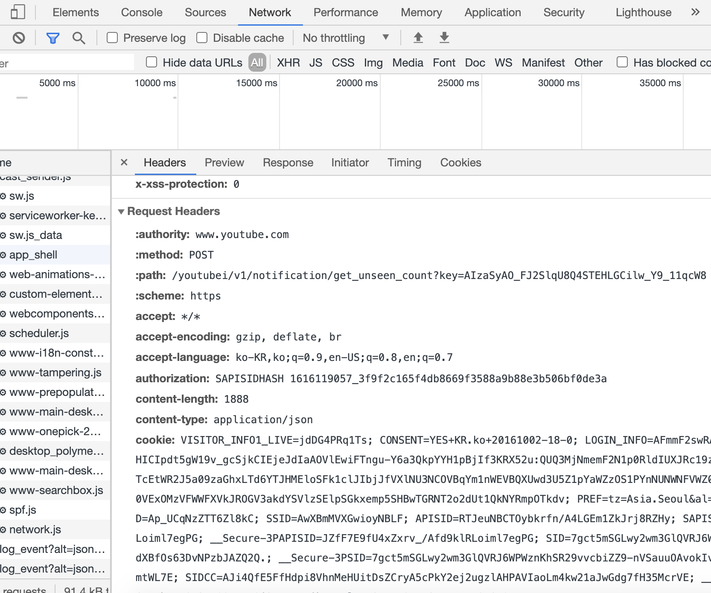
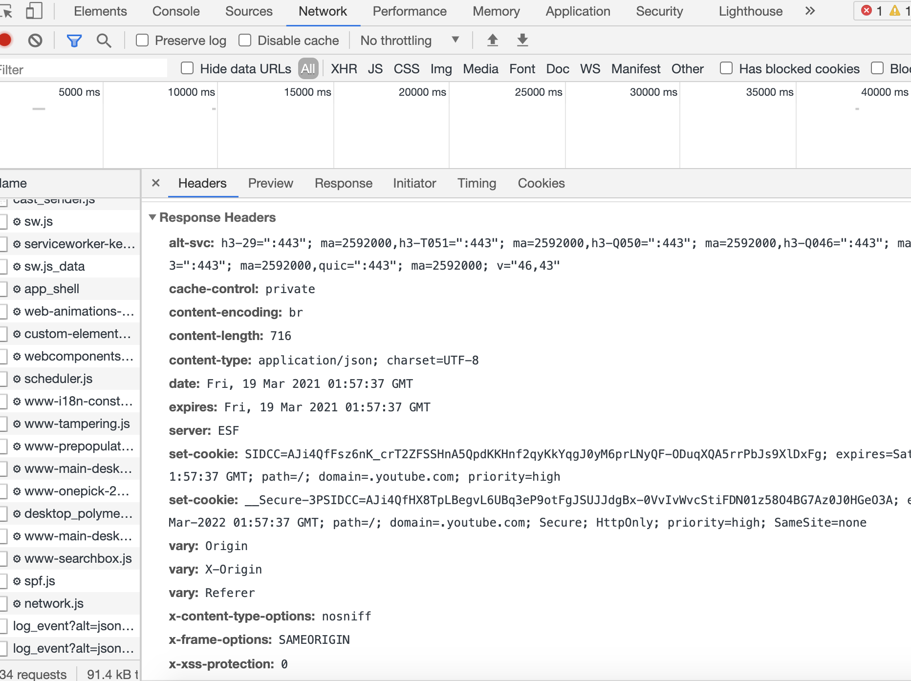

[cors](#cors)
[http요청](#http요청)
[URL입력이란?](#URL입력이란?)
[Http헤더](#Http헤더)
[https](#Https)
[대표적인응답코드](#대표적인응답코드)

# cors

> same-origin policy
>
> - 불러온 문서나 스크립트가 다른 출처에서 가져온것이라면 이는 잠재적인 악성 문서이거나 공격 경로일수 있기 때문에 기본적으로 같은 출처가 아니라면 접근이 허용되지 않는데 이를 Cross-origin-Resource-Sharing 라고한다.

#### 해결방법은 어떤것들이 있나요???

### 1. 서버측에서 Access-Control-Allow-Origin response 헤더를 추가

```
app.get('/corstest',(req,res)=>{
  let data = ...
  res.header("Access-Control-Allow-Origin","http://localhost:3000")
  res.send(data)
})
```

### 2. Cors 미들웨어 사용

```
let option = {
    origin: true,
    methods: ["GET", "POST", "PUT", "OPTION"],
    credentials: true,
  }
app.use(cors())

```

### 3. 클라이언트측

```
{withCredential: true} || axios.defaults.withCredentials = true
```

# http요청

### http 요청의 종류 || http request method

- Get,Post,Put,Options,Delete,Patch
- get : 데이터를 받는데 사용하는 method
- post : 특정 리소스에 엔터티를 제출할때 쓰인다.(리소스의 생성 / 반복된 요청에 새로운 리소스 반환)
- put : 특정 리소스의 수정과 생성 (반복된요청에 같은 리소스를 반환한다.)
- patch : 특정 리소스의 수정(일부)
- option : 특정 엔드포인트가 어떤 메소드를 허용하는지 알고자 할 때 사용한다(preflight요청시 주로 사용된다.)

# URL입력이란?

### url 의 구조

- protocol + url + port

1. HSTS 목록 조회

- Http 응답 헤더에 "Strict Transport Security"라는 필드가 존재 하면 해당 브라우저는 해당서버는 HTTPS만을 통신에 이용하고 이러한 서버를 HSTS 목록에 담아놓는다.

2. DNS 서버

- url 을 DNS 서버를 통해 ip 로 바꿔준다.

3. Router

- 라우터의 라우팅을 통해 요청이 해당 ip 로 전달된다.

4. ip 주소를 mac 주소로 변환

5. 대상 서버와 TCP 소켓연결

- 3-ways-handshake 라는 과정을 통해 연결이된다.
- HTTPS 의 경우 TSL 핸드쉐이킹이 추가 된다.

6. 서버는 HTTP(s) 프로토콜로 요청내용을 확인한뒤 응답합니다.

7. 브라우저는 응답을 해석하고 페이지를 해석해서 띄웁니다.

# Http헤더

#### general header

- date, content-type, content-length, content-language, locatioin ...

#### Http request header



- host, port, user-Agent(소프트웨어,브라우저 ,os), cookie, authorization, origin(cors 확인)

#### Http response header



- server(서버정보) , set-cookie, allow(메서드리스트), Access-control-allow-origin(cors 허용 도메인), expires(리소스 캐시 만료일시)

# Https

#### Http란?

- 클라이언트/서버 데이터를 주고받기 위한 프로토콜

#### Http + secure

- 암호화 되지않은 평문데이터 > ssl 프로토콜을 이용하여 대칭키 방식을 기반 데이터를 암호화한다.

#### CA

- 일반 기업은 CA 에 돈을 지불하고 공개키를 인증서화 한다. CA 기업은 개인키로 암호화 하여 일반기업에게 제공한다.
- 브라우저는 CA 의 공개키를 미리 가지고 있다.
- 기업은 개인키로 암호화된 인증서를 사용자에게 보내주고 브라우저는 공개키를 제공함으로 인증서를 복호화 하여 개인크를 알아내고 그걸 이용해 암호화하여 요청을 전송한다.

# 대표적인응답코드

-1xx: 요청에 대한 응답 진행중(조건부응답)
-2xx: 요청에 대한 응답 성공적인 처리
-3xx: 응답을 위한 추가적인 동작필요(리다이렉션)
-4xx: 클라이언트 오류(400:잘못된 요청 , 401:잘못된 권한 , 404:요청에대한 리소르를 찾을수 없음)
-5xx: 서버 오류
